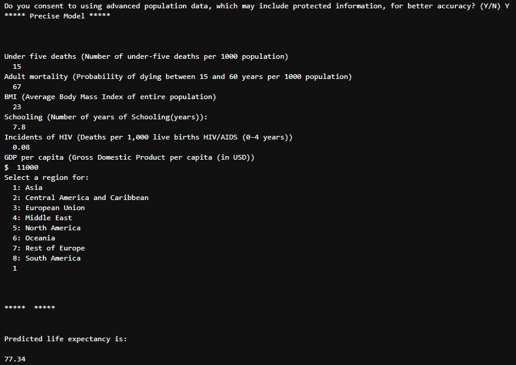
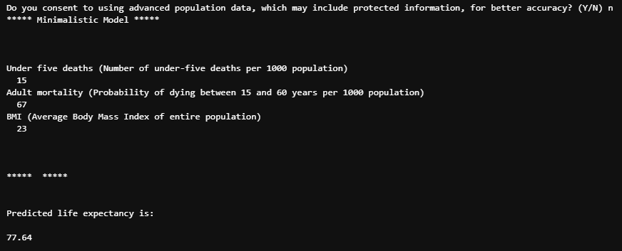

# Life Expectancy Predictive Modelling 📈

## Table of Contents
1. [Project Description](#project-description)
2. [Installation](#installation)
3. [Description of Files](#description-of-files)
4. [Usage](#usage)
6. [Authors](#authors)
   
## Project Description
In this project, we aimed to predict life expectancy across countries from population statistics data provided by the World Health Organization (WHO), taking into account ethical considerations. The dataset includes information from 2000 to 2015 for 179 countries, with various factors that could influence life expectancy such as mortality rates, immunisation coverage, economic indicators, and healthcare metrics.

The primary objectives of this project were:
- **Exploratory data analysis (EDA)**: To discover the relationships between life expectancy and other socioeconomic and health-related factors.
- **Model development**: To build two linear regression models for estimating life expectancy based on selected features.
  - **Minimalistic model**: Using a minimal set of non-sensitive features.
  - **Precise model**: Using a more elaborate set of features, including sensitive features, for better model performance.
- **Interactive function**: To build an interactive function containing both models, allowing users to input relevant data and predict life expectancy.

## Installation
1. Open your command prompt.
2. Navigate to your desired directory.
3. Git clone this repository using the following command:
   ```bash
   git clone https://github.com/IsabelleRaj/Life-Expectancy-Prediction
   ```
## Description of Files

### Exploratory Data Analysis (EDA) - `eda_analytica.ipynb`
- Train-test split of the dataset.
- Exploration and visualisation of the relationships between life expectancy and features.

### Feature Engineering - `fe_analytica.ipynb`
- Feature selection for the 'precise' and 'minimalistic' models.
- Scaling of features using MinMaxScaler, RobustScaler, and StandardScaler.
- Logarithmic transformations for features like GDP and HIV incidence.

### Model Development - `modelling_testing_analytica.ipynb`
- Linear regression model development and performance testing.

### Interactive Function - `app_analytica.ipynb`
- Text-based user input interface.
- Appropriate validation steps for user inputs.

## Usage

To run the function, open the notebook:
```bash
jupyter notebook "app_analytica.ipynb"
```

Here are the features of this app:
1. **Prompted with choice of model**: 'Do you consent to using advanced population data, which may include protected information, for better accuracy? (Y/N)'.
2. **Precise model**:
   - Enter the requested features: Under five deaths, Adult mortality, BMI, Schooling, Incidents of HIV, GDP per capita and Region (e.g., Asia, Europe).
   - Predicts the life expectancy.
4. **Minimalistic model**:
   - Enter the requested features: Under five deaths, Adult mortality and BMI.
   - Predicts the life expectancy.

Here is a demonstration:

<div style="display: flex; gap: 10px;">
  
  
</div>

## Authors
This was written by [@IsabelleRaj](https://github.com/IsabelleRaj), [@Ale42RA](https://github.com/Ale42RA) and [@BRTechArt-Ben](https://github.com/BRTechArt-Ben) (Team Analytica) as part of the Digital Futures Academy.
